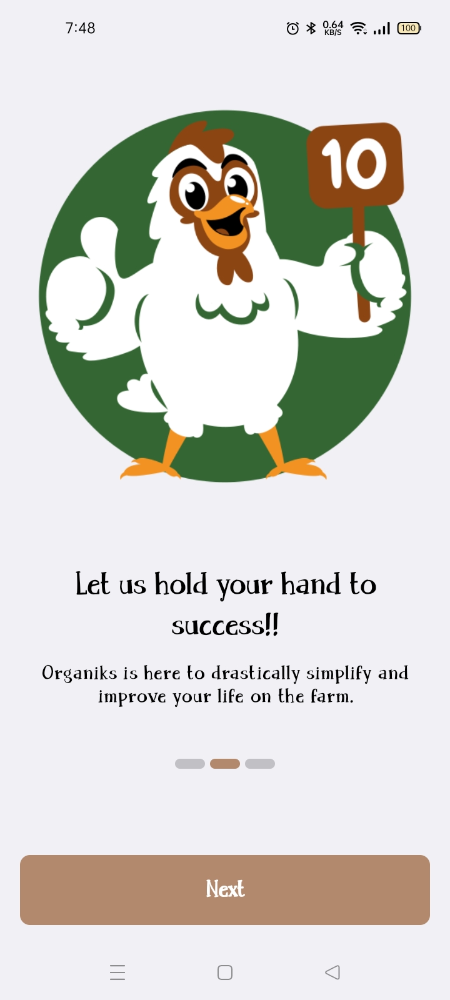
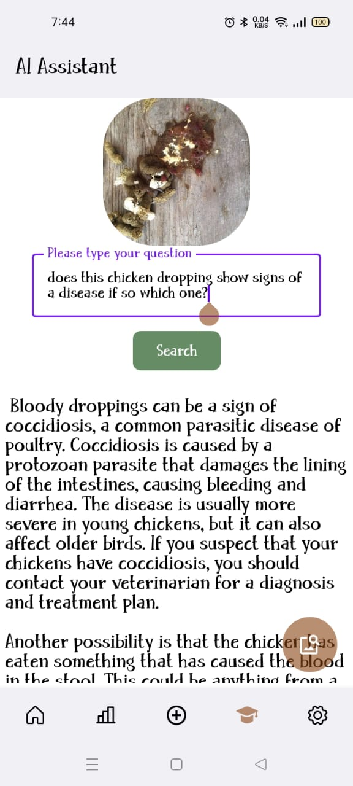
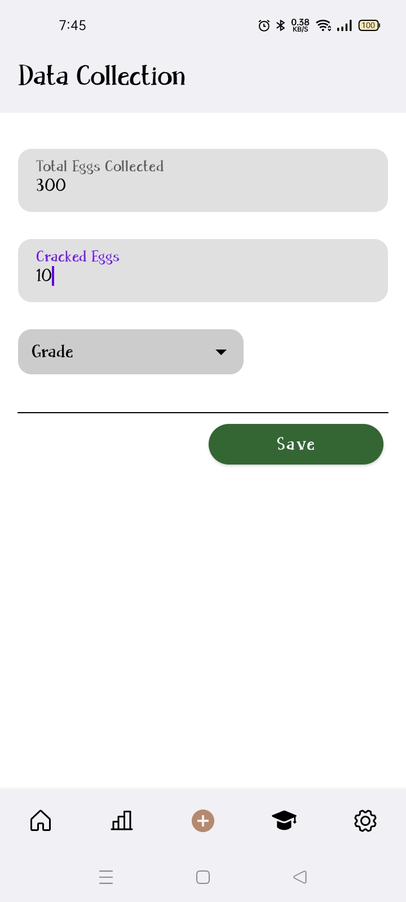
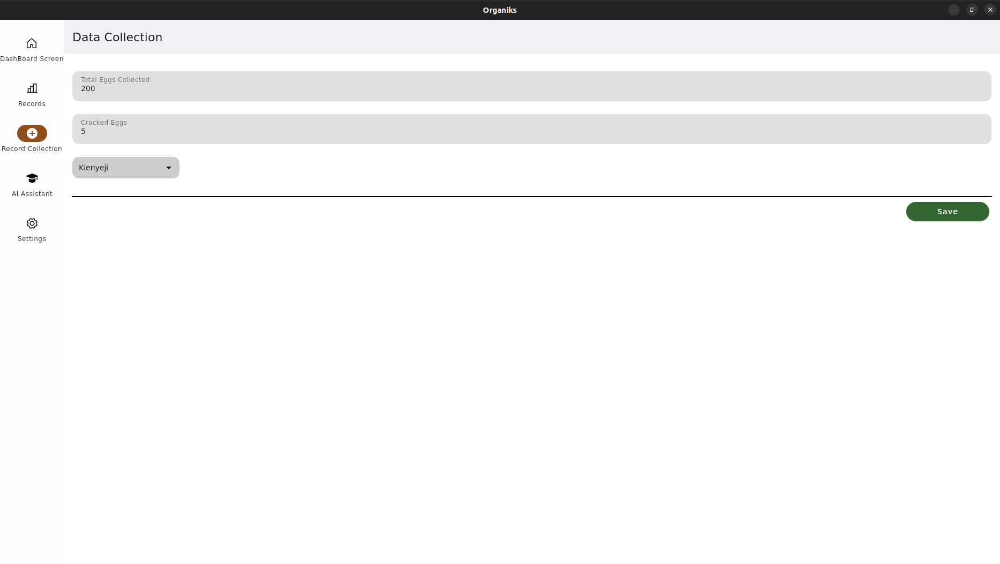
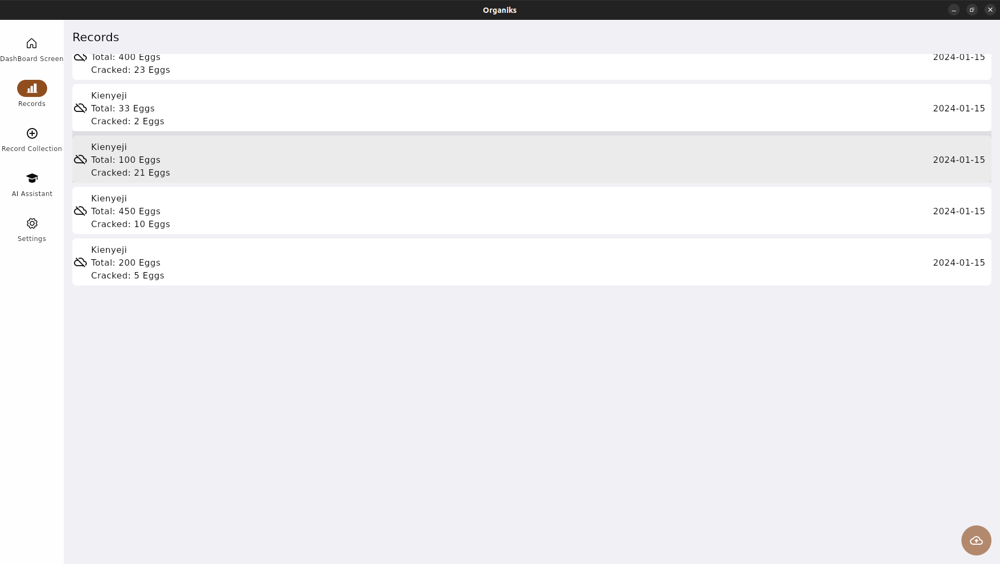
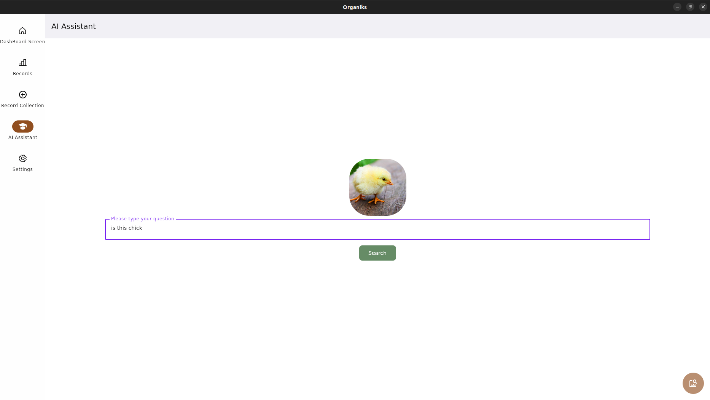

# Organiks
Organiks Platform combines Compose Multiplatform app(Android, Desktop) + KTOR server + Gemini AI aimed at being the digitizing tool for the Agricultural Sector which has been neglected
in terms of Technology here in Africa which.

Organiks is a story of two friends with a Love for Agriculture, one a MicroBiologist and the other a Techie in love with Compose.

The Platform aims at being a Farmers Offline First tool to store their farm records even when offline and when
they have access to Internet Connection they can backup their data(i.e Offline First) to
the backend Server also within the project.

In combination with Offline First Record Keeping, Organiks has implemented the Gemini AI LLM which acts as a farmers assistant whether they might have doubts
whether their birds, animals or plants have been attacked by diseases inline with Googles promise of "a world responsibly empowered by AI".

## 🛠️ WIP 🛠️
> Please note that this project is still under development and some features may not work as expected.

> If you find any bugs or have any suggestions, feel free to open an issue or a pull request.

## Platforms
 |  |  | 
:----: | :----: | :----: | :----:
✅ | ✅ | ✅ | Planned

## Screenshots
### Android
  

### Desktop

## Architecture
The app is shared between Android, Desktop with Compose Multiplatform and Server with Ktor within the same project.
### Modules
- shared:
  - contains all the shared code between the platforms
- android:
  - contains the android app
- desktop:
  - contains the desktop app
- server:
  - contains the backend ktor app

## Built with
- [Kotlin Multiplatform](https://kotlinlang.org/docs/multiplatform.html) - The Kotlin Multiplatform technology is designed to simplify the development of cross-platform projects.
- [Compose Multiplatform](https://www.jetbrains.com/lp/compose-multiplatform/) -  a modern UI framework for Kotlin that makes building performant and beautiful user interfaces easy and enjoyable.
- [Ktor Server](https://ktor.io/docs/intellij-idea.html) -  Ktor is an asynchronous framework for creating microservices, web applications.
- [Ktor Client](https://ktor.io/docs/getting-started-ktor-client.html) -  a multiplatform asynchronous HTTP client, which allows you to make requests and handle responses.
- [SQLDelight](https://github.com/cashapp/sqldelight) - SQLDelight is an open-source library developed by Cash App (formerly Square, Inc.) for working with SQL databases in Kotlin-based Android and multi-platform applications.
- [Multiplatform Settings](https://github.com/russhwolf/multiplatform-settings) - A Kotlin Multiplatform library for saving simple key-value data.
- [Koin](https://insert-koin.io/) - The pragmatic Kotlin & Kotlin Multiplatform Dependency Injection framework.
- [Voyager](https://voyager.adriel.cafe/) - A multiplatform navigation library.
- [Kotlinx-datetime](https://github.com/Kotlin/kotlinx-datetime) - KotlinX multiplatform date/time library.
- [Kotlinx-serilization](https://github.com/Kotlin/kotlinx.serialization) - Kotlin multiplatform / multi-format serialization.

## Run project
### Android
To run the application on android device/emulator:
- open project in Android Studio and run imported android run configuration

### Desktop
Run the desktop application: `./gradlew :desktop:run`

  
